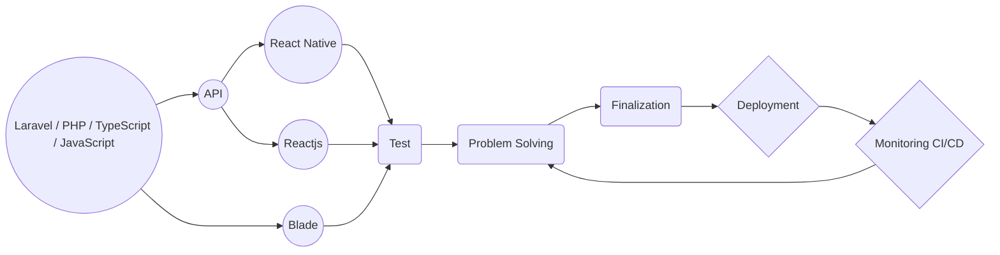

### I'm using those technologists to create a clean website:
------------------------------------------------------------
`➦ HTML5, CSS3, JavaScript, TypeScript & jQuery, Bootstrap`  
`➦ PHP with OOP (PDO)`  
`➦ MySQL`  
`➦ MVC (Pattern) (Custom Framework)`  
`➦ Laravel`  
`➦ Rest API`  
`➦ React.js, Router, Axios`  
`➦ React Native`  
`➦ Bootstrap, React Bootstrap`  
`➦ Material-UI`  
`➦ Twilio SMS` 
`➦ Sendgrid Email`  

### Deployment:
-----------
`➦ VPS`  
`➦ Cloud Server`  
`➦ Ubuntu Server`  
`➦ AWS`  

### What Services you will get from me:
----------------------------------
`➦ Bug Fixing`  
`➦ Website Monitoring`  
`➦ Installing PHP, Laravel script`  
`➦ Script upgrade to new features`  
`➦ Web API Integration`  
`➦ Existing script customization`  
`➦ Social media login`  
`➦ Adding new features`  
`➦ Ecommerce Website`  
`➦ CRM, CMS, SMS, other management systems`  
`➦ Payment gateways`  
`➦ Others which you want with PHP`  
`➦ Support: asap`  

